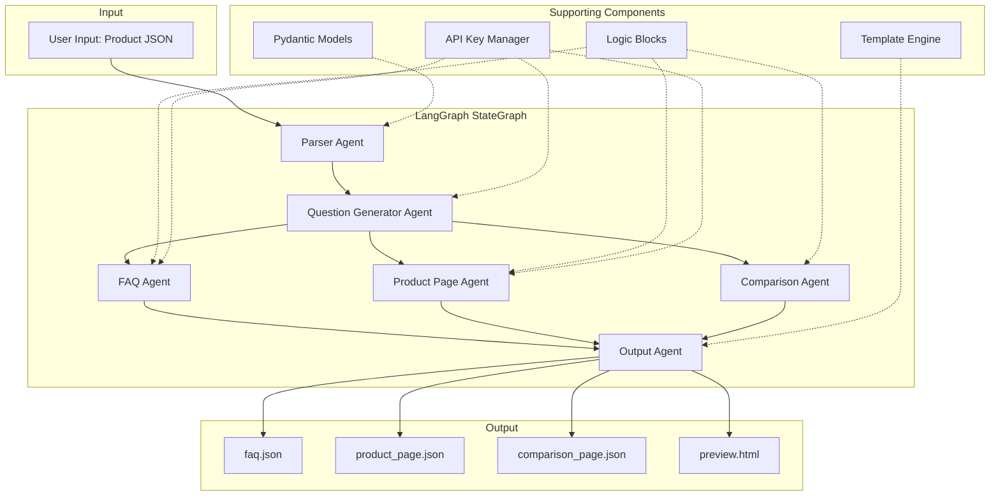
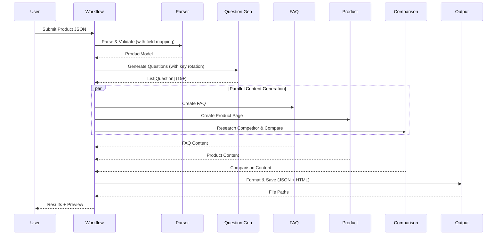
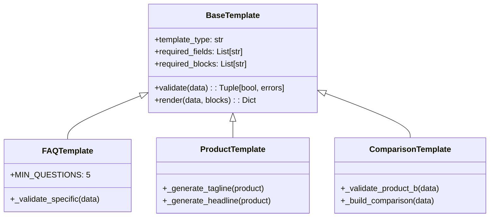

# Multi-Agent Content Generation System - System Design Documentation

## 1. Problem Statement

### Objective

Design and implement a modular agentic automation system that:

- Takes structured product data as input (any product type, not just skincare)
- Automatically generates 15+ categorized user questions
- Creates 3 machine-readable content pages (FAQ, Product, Comparison)
- Generates a minimal modern ecommerce preview page
- Demonstrates production-grade multi-agent architecture

### Key Challenges

1. **Modularity**: Avoid monolithic design; each agent must have single responsibility
2. **Orchestration**: Coordinate multiple agents with proper state management
3. **Content Engineering**: Create reusable logic blocks and template engine
4. **Quality**: Ensure type safety, error handling, and extensibility
5. **Flexibility**: Accept various input formats and field names
6. **Resilience**: Handle API rate limits with key rotation

### Requirements

- 6 distinct agents with clear boundaries
- LangGraph StateGraph for orchestration
- 5+ reusable logic blocks
- Custom template engine with validation
- ≥15 questions, ≥5 FAQ answers, realistic competitor comparison
- 3 valid JSON output files + HTML preview

---

## 2. Solution Overview

### Architecture Philosophy

We adopted an **Orchestrator Pattern** where LangGraph's StateGraph coordinates all agents. Each agent is stateless, receives input from the shared state, performs its task, and returns updates to the state.

**Key Design Principles:**

- **Single Responsibility**: Each agent does one thing well
- **Stateless Agents**: No hidden global state; state flows through LangGraph
- **Composable Logic Blocks**: Pure functions that transform data
- **Template-Based Output**: Validated, structured JSON generation
- **Flexible Input**: Field name mapping for various product types

### Technology Choices

| Component       | Technology                 | Rationale                                |
| --------------- | -------------------------- | ---------------------------------------- |
| Agent Framework | LangChain                  | Industry-standard, flexible architecture |
| Orchestration   | LangGraph StateGraph       | Explicit state management, typed state   |
| LLM (Content)   | Llama 3.3 70B / Gemma 3 1B | High-quality content generation          |
| Validation      | Pydantic 2.0               | Type-safe, automatic validation          |
| UI              | Streamlit                  | Rapid prototyping, interactive           |

### LLM Configuration

| Provider | Model                   | Use Case               |
| -------- | ----------------------- | ---------------------- |
| **Groq** | llama-3.3-70b-versatile | All content generation |

> **Note:** This system uses Groq exclusively. No external search APIs are used.

---

## 3. Scopes & Assumptions

### In Scope

- Product data parsing and validation with flexible field names
- Automated question generation (15+)
- FAQ, Product, and Comparison page generation
- Fictional competitor generation via LLM (no external search)
- JSON output with metadata
- Modern minimal HTML ecommerce preview
- Streamlit demo UI with JSON editor and text fields

### Out of Scope

- Database persistence
- User authentication
- Production deployment
- Multi-language support
- Real-time collaboration

### Assumptions

- Input is a valid JSON object (field names are flexible)
- Groq API is available with provided key
- Competitor product is ALWAYS fictional (no external search)
- Single product processing per run

### Key Features

- **Flexible Field Mapping**: Maps alternative field names automatically
  - `product_name` → `name`
  - `skin_type` → `target_users`
  - `key_ingredients` → `key_features`
  - `concentration` → `product_type`
  - `side_effects` → `considerations`
- **API Key Rotation**: Multiple keys with automatic rotation on rate limits
- **Dynamic Preview**: All content from JSON, no hardcoded text
- **No External Facts**: Product A content strictly from input data only

---

## 4. System Design

### 4.1 Architecture Diagram



### 4.2 Workflow Execution



### 4.3 Agent Responsibilities

| Agent                  | Input                    | Output             | Responsibility                                |
| ---------------------- | ------------------------ | ------------------ | --------------------------------------------- |
| **Parser**             | Raw JSON dict            | ProductModel       | Validate, map field names, apply defaults     |
| **Question Generator** | ProductModel             | List[Question]     | Generate 15+ categorized questions via LLM    |
| **FAQ**                | ProductModel + Questions | FAQ Content        | Create 5+ Q&As with answers using LLM         |
| **Product Page**       | ProductModel             | Product Content    | Build comprehensive product page with LLM     |
| **Comparison**         | ProductModel             | Comparison Content | Research competitor via LLM, compare products |
| **Output**             | All Content              | JSON + HTML Files  | Validate, add metadata, save files            |

### 4.4 State Schema

```python
class WorkflowState(TypedDict):
    # Input
    product_data: Dict[str, Any]

    # Parsed
    product_model: Optional[Dict[str, Any]]
    questions: List[Dict[str, Any]]

    # Generated Content
    faq_content: Dict[str, Any]
    product_content: Dict[str, Any]
    comparison_content: Dict[str, Any]

    # Output
    output_files: List[str]

    # Metadata
    errors: List[str]
    logs: List[str]
    current_step: str
```

### 4.5 Logic Blocks

Logic blocks are **pure functions** that transform product data into structured content:

| Block               | Purpose                        | Output                                          |
| ------------------- | ------------------------------ | ----------------------------------------------- |
| `benefits_block`    | Extract and structure benefits | primary_benefits, detailed_benefits, categories |
| `usage_block`       | Parse usage instructions       | steps, frequency, best_time, tips               |
| `ingredients_block` | Enrich ingredient data         | active_ingredients, ingredient_details          |
| `safety_block`      | Generate safety info           | side_effects, precautions, suitability          |
| `comparison_blocks` | Compare two products           | ingredients_diff, benefits_diff, pricing        |

### 4.6 Template Engine

Templates validate and structure output:



### 4.7 API Key Rotation

```python
# config.py
GROQ_API_KEYS = [key1, key2, key3, key4]  # Multiple keys
_current_key_index = 0

def invoke_with_retry(prompt: str, max_attempts: int = 4) -> str:
    """Invoke LLM with automatic key rotation on rate limits."""
    for attempt in range(max_attempts):
        try:
            api_key = get_next_api_key()  # Rotate key
            llm = ChatGroq(api_key=api_key, model="llama-3.3-70b-versatile")
            return llm.invoke(prompt).content
        except RateLimitError:
            logger.warning(f"Rate limit, rotating key...")
            continue
    raise Exception("All API keys exhausted")
```

---

## 5. Design Decisions

### Why LangGraph over Simple Orchestration?

- **Typed State**: TypedDict ensures type safety
- **Explicit Edges**: Clear visualization of workflow
- **Extensibility**: Easy to add new agents/nodes
- **Error Handling**: State tracking enables graceful recovery

### Why Class-Based Templates?

- **Validation**: Enforce structure before rendering
- **Reusability**: Base class with shared logic
- **Extensibility**: Easy to add new template types
- **Metadata**: Automatic tracking of logic blocks used

### Why Flexible Field Mapping?

- **Universal**: Works with any product type (software, hardware, cosmetics)
- **User-Friendly**: No strict field name requirements
- **Robust**: Applies sensible defaults for missing fields

### Why API Key Rotation?

- **Rate Limit Handling**: Automatic rotation when quota exceeded
- **Resilience**: Multiple keys ensure continuous operation
- **Transparent**: Works without user intervention

---

## 6. Extensibility Considerations

### Adding New Agents

1. Create new agent class in `agents/`
2. Add node function in `orchestrator/workflow.py`
3. Add node and edges to StateGraph
4. Update WorkflowState if needed

### Adding New Logic Blocks

1. Create pure function in `logic_blocks/`
2. Export from `__init__.py`
3. Use in relevant agents

### Adding New Templates

1. Extend BaseTemplate in `templates/`
2. Define required_fields and required_blocks
3. Implement `_validate_specific()` and `_render_structure()`

### Adding New Field Mappings

1. Update `FIELD_MAPPINGS` in `agents/parser_agent.py`
2. Add alternative field names to the mapping

---

## 7. Output Specifications

### FAQ JSON Structure

```json
{
  "page_type": "faq",
  "product_name": "...",
  "questions": [
    {
      "id": "q1",
      "category": "Informational",
      "question": "...",
      "answer": "...",
      "logic_blocks_used": ["benefits_block"]
    }
  ],
  "metadata": {
    "generated_at": "ISO-timestamp",
    "agent": "output_agent",
    "version": "1.0"
  }
}
```

### Product Page JSON Structure

```json
{
  "page_type": "product",
  "product": {
    "name": "...",
    "tagline": "...",
    "headline": "...",
    "description": "...",
    "key_features": [...],
    "ingredients": {...},
    "benefits": {...},
    "how_to_use": {...},
    "suitable_for": [...],
    "safety_information": {...},
    "price": {...}
  },
  "metadata": {...}
}
```

### Comparison JSON Structure

```json
{
  "page_type": "comparison",
  "products": {
    "product_a": {...},
    "product_b": {...}
  },
  "comparison": {
    "ingredients": {...},
    "benefits": {...},
    "price": {...}
  },
  "recommendation": "...",
  "metadata": {...}
}
```

### HTML Preview

- Minimal modern design
- All content dynamically rendered from JSON
- No hardcoded product-specific text
- Sections: Hero, Benefits, Usage, Comparison, FAQ

---

## 8. Conclusion

This multi-agent content generation system demonstrates production-grade agentic architecture with:

- **Clear Boundaries**: Each agent has single responsibility
- **Proper Orchestration**: LangGraph StateGraph with typed state
- **Reusable Components**: Logic blocks and templates
- **Extensible Design**: Easy to add new agents, blocks, templates
- **Flexible Input**: Field name mapping for any product type
- **Resilient**: API key rotation for rate limit handling
- **Quality Output**: Validated, machine-readable JSON + HTML preview

The system transforms raw product data into rich, structured content pages through a coordinated pipeline of specialized agents, logic blocks, and templates.

---

## Repository

**GitHub**: https://github.com/yk0007/kasparro-agentic-yaswanth-kuramdasu
